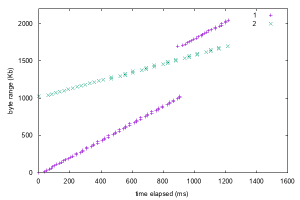

# CompNet.Lab3: Multipath HTTP/2

[TOC]

## Introduction

In the third lab, you are required to develop an HTTP/2-based downloader, which fetches HTTP objects over multiple network paths. The idea behind this lab originates from the paper [_MP-H2: A Client-only Multipath Solution for HTTP/2_]() (Nikravesh et al.). Before starting working on the lab, you are supposed to carefully read the paper for a better understanding of how the downloader functions. 

For simplicity, we won't implement the downloader on an Android device, as described in the paper. Instead, the downloader will be implemented on the top of an HTTP/2 library in the C programming language. Also, to make things more comfortable, we omit the DNS lookup here, and the IP addresses of the servers are given.

While the paper focuses on two paths, it is possible to apply this design to three or more paths. In the lab, we are going to implement the downloader in a more scalable way. Your downloader should be able to leverage three paths.

Your downloader will be run in an emulated environment with exactly three CDNs and one client. In order to emulate a network environment with two or more CDN servers, we will take advantage of [Linux namespaces](http://man7.org/linux/man-pages/man7/namespaces.7.html) to set up a virtual network on a Linux machine. Three CDN servers serve the same content. Your target in this lab is to reduce the downloading time for a given file. We will measure the downloading time of your implementation under varied network conditions.

After finishing this lab, you are expected to:

- Get a taste of how the multipath solution boosts downloading performance.
- Be familiar with new features in HTTP/2, including stream multiplexing, flow control, and application-layer PING.
- Be capable of adding new features to an existing production-level library.

## Handout Instructions

This section will instruct you to set up the development environment on a Linux machine. We will evaluate your programs in the same environment.

### Download the HTTP/2 Library

Our lab is based on a mature HTTP/2 Library, named [H2O](https://github.com/h2o/h2o). After building the library on your Linux machine, you can:

- Follow the [Wiki](https://github.com/h2o/h2o/wiki) to run the static content server. When setting up the SSL (443 port), you can create a self-signed certificate and disable certificate verification on the client.
- Develop your multipath downloader with the help of the library. See [Hints on Implementation]() for details.

### Emulate Network Condition

Here we introduce two tools: NetEm and Mahimahi.

[NetEm](http://man7.org/linux/man-pages/man8/tc-netem.8.html) is an enhancement of the Linux traffic control facilities that allow adding delay, packet loss, duplication and more other characteristics to packets outgoing from a selected network interface. 

[Mahimahi](http://mahimahi.mit.edu) is a set of lightweight tools that can emulate network conditions. Refer to the paper [_Mahimahi: Accurate Record-and-Replay for HTTP_]() (Netravali et al.) for a better understanding of how it works. You can find some network condition traces [here](https://github.com/ravinet/mahimahi/tree/master/traces).

### Create a Virtual Network

Again, [vnetUtils]() is our good friend. You may find its usage in the handout of lab2. 

In lab3, you can create a virtual network by running `makeVNet` with the following configuration (note that the first and the last two blank lines are left intentionally):

```

3
0 1 10.100.1
0 2 10.100.2
0 3 10.100.3


```

By now, in addition to the default namespace, you have already set up three virtual network namespaces. This can be verified by running the command `ip netns list`. You can run a content server in each network namespace, and your downloader in the default namespace.

The aforementioned configuration is just an example. When testing your downloader, you can create virtual networks with any topologies. 

## Tasks

### Programming Task (50%)

Your downloader is supposed to work after receiving these arguments:

- Three servers' IP addresses.
- `-o [name]`: the file path on the CDN server. In other words, you can send a request `https://[host]/[name]` to download the file.
- the optional argument `-s [size]`: a hint indicating the file size is `size` bytes.

These are possible inputs (suppose your downloader is `h2o-mphttp`):

```
$ ./h2o-mphttp 10.100.1.2 10.100.2.2 10.100.3.2 -s 2097152 -o dir1/dir2/hello.flv
$ ./h2o-mphttp 10.100.1.2 -o dir1/dir2/hello.flv 10.100.2.2 10.100.3.2 
$ ./h2o-mphttp -s 2097152 10.100.3.2 10.100.1.2 10.100.2.2 -o dir1/dir2/hello.flv
```

We recommend [getopt()](http://man7.org/linux/man-pages/man3/getopt.3.html) here, a function parses the command-line arguments.

#### Test and Evaluation

The grading of the final hand-in will be based on the download time your downloader takes on the given traces. Each trace contains two bandwidth and delay profiles used to specify the network condition (imposed by Mahimahi), one for each CDN server. Final evaluation traces are kept secret.

#### Optional Tasks

The tasks below are optional.

- HTTP/1.1 Fallback: Although HTTP/2 is getting increasingly popular, many of today’s web servers still only support HTTP/1.1. Design your downloader to be compatible with HTTP/1.1 servers. Specifically, in this lab, the downloader should be capable of scheduling an HTTP/1.1 server and two HTTP/2 servers to download a file.
- Data Consistency Check: In the real world, content from two CDN servers might be different. One possible reason for the difference is that middle-boxes in the network may cache the content data. If one of the paths is cached while the other is not, you may receive inconsistent data after CDN servers update their content. Design your downloader to report an error if such a situation arises.

### Writing Task (20%)

Describe your implementation:

- How do you estimate the bandwidth and the delay of a path?
- How do you assign jobs to the three paths?

In addition to the questions above, you are encouraged to write down other design aspects of your implementation. Comments and ideas on the multipath HTTP solution are also welcomed!

### Drawing Task (30%)

You are required to draw some figures to prove that your downloader does work: 

- under static network conditions
- under varying bandwidth conditions (you may use the traces provided in Mahimahi)
- with a high-bandwidth path and two low-bandwidth paths
- with a short-delay path and two long-delay paths

You are encouraged to submit other figures that you find interesting.

Here are two powerful plotting tools. You can choose other tools at your convenience.

- [Gnuplot](http://www.gnuplot.info): a portable command-line driven graphing utility for Linux, OS/2, MS Windows, OSX, VMS, and many other platforms. 
- [Matplotlib](https://matplotlib.org/index.html): a Python 2D plotting library which produces publication quality figures in a variety of hardcopy formats and interactive environments across platforms.

Here is an example using Gnuplot:

```
$ cat plot.gnu
set terminal png transparent enhanced font "arial,10" fontscale 1.0 size 600, 400 
set output 'gnuplot.png'
set style increment default
set style data lines
set xlabel 'time elapsed (ms)'
set ylabel 'byte range (Kb)'
plot [0:1600][0:2200] "1.dat" title '1' with points, "2.dat" title '2' with points 
$ head 1.dat 
0 0
64 16
77 32
91 48
102 63
117 79
130 95
145 111
159 127
172 143
$ gnuplot -c plot.gnu 
```

Result:



## Hints on Implementation

### RFCs are Important

- [RFC 2616](https://httpwg.org/specs/rfc7233.html): Hypertext Transfer Protocol (HTTP/1.1): Range Requests
- [RFC 2818](https://httpwg.org/specs/rfc2818.html): HTTP Over TLS
- [RFC 7540](https://httpwg.org/specs/rfc7540.html): Hypertext Transfer Protocol Version 2 (HTTP/2)
- [RFC 7639](https://httpwg.org/specs/rfc7639.html): The ALPN HTTP Header Field 

In this lab, you don't have to follow the RFC strictly, but your downloader should be able to communicate with the H2O static content server.

### Where to Start

The file `/src/httpclient.c` is a nice example. 

[TODO]

## Handin Instructions

In this lab, you should submit a directory named `lab3` containing the following items in an archive named `lab3-[your name]-[your student ID].tar`:

- `src/`: Source code of your programs
- `Makefile` / `CMakeLists.txt`: Files that instruct build system to build your programs. 
- `codelist.[pdf|html|md|docx|txt]`: A single document describing the way how your downloader work.
- `plot/`: [TODO]

## Contact the Staff


